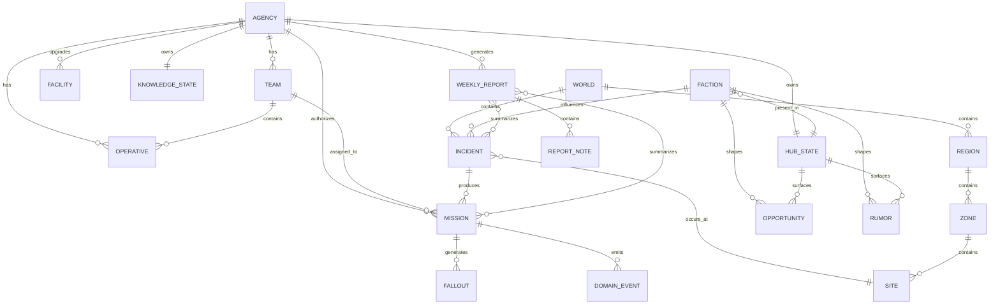

# Containment Protocol — Entity Relationship Model (Detailed)

## Purpose

This document defines the major entities in Containment Protocol and how
they relate to one another.

It is intended to:

- clarify entity boundaries and ownership
- distinguish canonical simulation state from surfaced output
- provide a shared conceptual model for future systems/docs

This is a conceptual ER model, not a database schema.

---

## Core design rule

Containment Protocol is an institution-first game.

The entity model should reflect that:

- reports and surfaced output are downstream of canonical domain state

---

## 1. High-level entity map

```text
Agency
├─ Operatives
├─ Teams
├─ Facilities
├─ Support / Specialists
├─ Economy / Funding
├─ Knowledge
├─ Hub
├─ Missions
└─ Reports

World
├─ Regions
├─ Zones
├─ Sites
├─ Incidents
└─ Factions

Incidents
└─ can produce Missions

Missions
├─ use Teams
├─ affect Operatives
├─ consume Support
├─ generate Fallout
└─ update Reports / World / Hub / Factions
```

---

## 2. Primary entities

### Agency

**Description:** The player-controlled organization. This is the root
institutional entity.

**Owns:**

- support capacity
- specialist capacity
- funding / legitimacy / standing
- global pressure state
- access to facilities and upgrades
- overall campaign-facing operational posture

**Relationships:**

- has many operatives
- has many teams
- has many facilities/upgrades
- has one or more support capacity subsystems
- has one economy state
- has one knowledge state
- has one hub state
- has many reports
- responds to many incidents through missions

### Operative

**Description:** A field-capable individual who can be trained, equipped,
deployed, injured, recovered, lost, or replaced.

**Key relationships:**

- belongs to one agency
- may belong to zero or one active team at a time
- may participate in many missions over time
- may hold one or more certifications
- may hold one role
- may carry many gear items

**Notes:**
Operatives matter as systemically meaningful field assets, but the game
should avoid becoming a full life-sim.

### Team

**Description:** A deployable operational unit composed of operatives.

**Key relationships:**

- belongs to one agency
- contains many operatives
- may be assigned to zero or one active mission
- has readiness/cohesion derived partly from member state

**Notes:**
Team is the main bridge between agency state and operational resolution.

### Incident

**Description:** A simulated problem, anomaly, threat, crisis, or pressure
source requiring attention.

**Key relationships:**

- exists in one world/site context
- may be associated with one region, zone, or site
- may generate zero or more mission opportunities over time
- may be influenced by factions
- may escalate if ignored or partially resolved

**Notes:**
Incident is not the same thing as mission. An incident is the problem.
A mission is the player's response path.

### Mission

**Description:** A bounded operational response to an incident or objective.

**Key relationships:**

- may be linked to one incident
- may have one assigned team
- consumes readiness, support, or specialist capacity
- generates one or more outcomes
- may generate fallout
- updates reports
- may affect faction, knowledge, hub, or world state

**Notes:**
Mission is the core operational execution entity.

### Faction

**Description:** An external or semi-external organization, bloc,
institution, or rival force.

**Key relationships:**

- exists in world state
- may affect incidents
- may affect hub opportunities
- may influence contracts, rumors, access, and legitimacy
- may respond to mission outcomes
- may have presence in the hub
- may have relationship state with the agency

**Notes:**
Factions are persistent actors shaping pressure and opportunity.

### Hub

**Description:** The bounded staging layer between operational weeks
where opportunities, rumors, services, faction presence, and
informational surfaces appear.

**Key relationships:**

- belongs to the agency/campaign state
- contains many opportunities
- contains many rumors
- may contain districts/services/presence markers
- is influenced by faction state, recent outcomes, and campaign conditions

**Notes:**
The hub is not a separate city sim. It is a campaign-facing surfaced environment.

### Facility

**Description:** A persistent institutional structure or upgrade that
changes agency capability.

**Key relationships:**

- belongs to one agency
- modifies capacity, recovery, procurement, training, or other throughput systems

**Notes:**
Facilities are long-horizon progression entities.

### Knowledge state

**Description:** The player-facing record of what is known, discovered,
suspected, or partially understood.

**Key relationships:**

- belongs to one agency/campaign
- references incidents, factions, sites, rumors, and intel fragments

**Notes:**
This separates world truth from player knowledge.

### Economy state

**Description:** The agency’s financial and market-facing condition.

**Key relationships:**

- belongs to one agency
- constrains procurement, upkeep, expansion, and recovery capacity
- may be affected by contracts, failures, and facilities

**Notes:**
If split across agency and economy, canonical ownership must be explicit.

### Report

**Description:** A player-facing summary of weekly events, operational
results, bottlenecks, and consequences.

**Key relationships:**

- belongs to one agency/campaign week
- references incidents, missions, fallout, pressure, support, or faction changes
- is generated from canonical domain state or domain events

**Notes:**
Reports are output entities, not sources of truth for simulation logic.

---

## 3. Supporting entities

- Support state: Institutional non-field capacity affecting throughput and follow-through.
- Support specialist: A bounded agency-side capability role.
- Recovery state: Tracks operative or equipment recovery status.
- Opportunity: An actionable surfaced item in the hub.
- Rumor: A surfaced information fragment.
- Site: A bounded operational location.
- Region / Zone: Spatial structures used for campaign geography and strategic pressure.
- Domain event: A logged event representing meaningful system output.

---

## 4. Relationship breakdown

- Agency 1 ---- * Operative
- Agency 1 ---- * Team
- Team 1 ---- \* Operative (Operative \* ---- 0..1 active Team)
- Incident 1 ---- * Mission
- Mission * ---- 1 Team
- Mission * ---- 1 Incident
- Mission 1 ---- * Fallout
- Agency 1 ---- * Facility
- Agency 1 ---- * Report
- Faction 1 ---- * Opportunity
- Faction 1 ---- * Rumor
- World / Region / Site 1 ---- * Incident
- Agency 1 ---- 1 KnowledgeState
- Agency 1 ---- 1 HubState

---

## 5. Mermaid ER diagram



---

## 6. Canonical ownership guidance by entity

- Agency owns: support state, specialist state, institutional pressure,
  legitimacy/standing/funding, high-level coordination/overload state
- Team owns: active team membership, team-local cohesion, deployment state
- Operative owns: injury/trauma/certification/role/loadout
- Incident owns: threat identity, severity, escalation, unresolved problem state
- Mission owns: operational response state, assignment, mission-local
  outcome, follow-through, mission-local fallout
- Hub owns: surfaced opportunities, rumors, district/service/faction-presence output
- Report owns: explanation output only

---

## 7. Common modeling mistakes to avoid

- Duplicating institutional state
- Treating incidents and missions as the same entity
- Letting reports become simulation state
- Turning support into a parallel character game
- Letting hub state become a second world sim

---

## 8. Suggested future diagrams

This ER model should eventually be paired with:

- architecture/game-state-schema.md
- architecture/event-schema.md
- systems/core-loop-flows.md
- systems/incident-generation.md
- systems/mission-resolution.md

---

## 9. Summary

Containment Protocol’s entity model is built around:

- one player-controlled agency
- many operatives and teams
- a persistent world that generates incidents
- missions as bounded responses
- factions and hub state as opportunity/pressure shapers
- reports as downstream explanatory output

The key structural rule is simple:
institutional state should stay canonical, operational state should stay
bounded, and surfaced output should stay derived.
