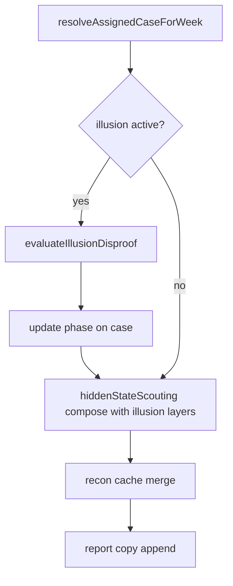

# SPE-70 — Hidden-state modality matrix slice 5 (false-entity / structural-illusion lifecycle)

One-page implementation plan. Linear: [SPE-2285](https://linear.app/spectranoir/issue/SPE-2285) (child under [SPE-70](https://linear.app/spectranoir/issue/SPE-70)). Follows shipped [SPE-2284](https://linear.app/spectranoir/issue/SPE-2284) (PR #2409).

| Field | Value |
| --- | --- |
| **Linear** | [SPE-2285 — Hidden-state modality matrix slice 5](https://linear.app/spectranoir/issue/SPE-2285) |
| **Parent** | [SPE-70](https://linear.app/spectranoir/issue/SPE-70) |
| **Branch** | `jamesdyedbq/spe-2285-hidden-modality-matrix-slice-5-illusion-lifecycle` |
| **Status** | Shipped — SPE-2285 / PR #2411 |

## Goal

Add a **bounded illusion lifecycle** for authored false-entity and structural-illusion cases: scans may show fabricated contacts or false terrain anchors, then transition to **disproved** and **collapsed** through deterministic interaction or counter-detection — not instant full reveal.

Slice 5 closes the parent AC line for “false entity / structural illusion sustains a bounded lifecycle and resolves through interaction, traversal, or targeted counter-detection.” It extends the shipped matrix stack (slices 1–4) without rewriting activation, recon cache, or modality report prefixes.

## Prerequisite (on `main` @ `dcee44a6`)

| Shipped | Anchor |
| --- | --- |
| Modality compose | `hiddenStateModality.ts`, `resolveScoutingWithCaseHiddenState` (SPE-2281) |
| Weekly orchestration | `evaluateHiddenStateScoutingWithRevealPayload` (SPE-2282) |
| Modality report copy | `detectionScanReportNotes.ts` (SPE-2283) |
| Recon cache | `hiddenStateScoutingReconCache.ts` (SPE-2284) |
| Case fields | `hiddenState`, `displacementTarget`, `counterDetection`, `route`, `tags` |

## Gap (pre-slice)

- False-position projection mislocates a **real** subject; there is no lifecycle for **fabricated** contacts or **false terrain** that later disproves.
- Scouting scans always assume a single truth subject; no `active → disproved → collapsed` phase machine.
- Parent [SPE-70](https://linear.app/spectranoir/issue/SPE-70) AC: illusion must resolve via interaction, traversal, or counter-detection — not immediate disbelief.

## Scope (this slice)

| In | Out |
| --- | --- |
| `HiddenStateIllusionState` on `CaseInstance` (`kind`, `phase`, `anchorLabel?`, `disproofReason?`) | Signature masking, glamour, out-of-phase modalities |
| `hiddenStateIllusionLifecycle.ts` — resolve activation from tags, phase transitions, scan projection helpers | New scan families or RNG |
| Extend `resolveHiddenStateModality` / compose path when illusion `active` | Full SPE-70 parent Done |
| **False entity** (`false-entity` tag + `hidden`): fabricated presence/category in `detectionScan`; truth `present: false` or withheld canonical subject | UI components / mission triage chips |
| **Structural illusion** (`structural-illusion` tag + `displaced` or `hidden`): false terrain anchor via `displacementTarget`; disproof via traversal/`route` + counter-detection | Rewriting `hiddenStateScoutingReconCache` |
| Disproof triggers (deterministic): `counterDetection`, strong scouting + recon cache pass ≥ 2, authored `route` traversal on structural cases | Mode-specific tells (speech, metadata spoofing) |
| Persist phase on case after weekly resolution + in-progress scouting pass | New event types (optional report suffix only) |
| Orchestration: illusion disproof before modality compose; collapse removes illusion overlay | Template catalog migration (fixtures only) |
| Tests: unit lifecycle + orchestration + multi-week `advanceWeek` disproof path | Instrumentation-attack / false-detection modality family |

## Illusion lifecycle contract

### Activation (authored)

| Kind | Requires | Initial `phase` |
| --- | --- | --- |
| `false_entity` | `hiddenState: 'hidden'` + case tag `false-entity` | `active` |
| `structural_illusion` | tag `structural-illusion` + (`hidden` or `displaced`) + optional `displacementTarget` as anchor | `active` |

If both tags present, prefer `false_entity` for compose (document in tests).

### Phases

```text
active → disproved → collapsed
```

| Phase | Player-facing behavior | Truth |
| --- | --- | --- |
| `active` | Fabricated contact or false terrain readout in tiered scan | Canonical subject hidden; illusion layer blocks full identity |
| `disproved` | Scan suffix / report note: illusion disproven; tiers may partially clear | Illusion layer stripped one step; subject may stay hidden |
| `collapsed` | Normal modality readouts (concealed / displaced / disguise path) | `hiddenStateIllusionState` cleared or `phase: collapsed` inert |

### Disproof triggers (deterministic, any one)

1. **Counter-detection** — `counterDetection: true` on weekly pass strips illusion layer (one layer id: `layer:false-entity` or `layer:structural-illusion`).
2. **Interaction / traversal** — case has non-empty `route` and tag `structural-illusion` (or `interaction-disproof`) → `disproved` on assigned week.
3. **Sustained recon** — `hiddenStateScoutingReconCache.scoutingPassCount >= 2` with unresolved nodes → `disproved` for `false_entity` (bounded follow-up scrutiny).

**Collapse** — after `disproved`, next weekly pass with any disproof trigger again OR mission `success`/`partial` → `collapsed` and clear illusion overlay.

### Scan / copy integration

- **Active false entity:** add concealment layer `layer:false-entity`; player-facing presence/category reference fabricated anchor label (e.g. `fabricated contact at annex-c`).
- **Active structural illusion:** layer `layer:structural-illusion`; reuse `applyFalsePositionScanProjection` anchor semantics when `displacementTarget` set.
- **Disproved:** append report resolution reason via existing `resolutionReasons` (domain string); optional `Structural illusion readout:` / `Fabricated contact readout:` prefix family reuse.
- **Collapsed:** illusion state removed; existing modality prefixes apply unchanged.

## Orchestration contract



- Run disproof **before** `evaluateHiddenStateScoutingWithRevealPayload`.
- Do not double-compose disguise + illusion fabricated identity as real disguise validation.
- Mission outcome math unchanged except existing bounded score hooks (reuse recon-cache route caution; optional small disproof malus when `active`).

## Acceptance

- [x] False-entity fixture: active phase shows fabricated scan tiers; truth does not confirm canonical subject identity.
- [x] Counter-detection or sustained-recon path transitions to `disproved`, then `collapsed` on follow-up week.
- [x] Structural-illusion fixture: false terrain anchor in scan; `route` + disproof tag transitions phase without instant `revealed`.
- [x] Collapsed case uses normal concealed/displaced modality readouts (slice 3 prefixes unchanged).
- [x] `npm run lint` + targeted `npm run test:run` green.

## TDD order

1. **Lifecycle unit tests** — activation from tags, phase transitions, collapse clears state.
2. **Scan projection** — active false entity vs structural illusion distinct `DetectionScanResult`.
3. **Disproof helpers** — counter-detection, route traversal, recon-cache pass threshold.
4. **Orchestration** — `resolveAssignedCaseForWeek` carries illusion state on effectiveCase.
5. **`advanceWeek`** — two-week structural-illusion or false-entity disproof integration.
6. **Regression** — slices 1–4 orchestration and report-copy tests unchanged.

## File touch list (expected)

| Area | Files |
| --- | --- |
| Lifecycle | `src/domain/hiddenStateIllusionLifecycle.ts` (new) |
| Modality compose | `src/domain/hiddenStateModality.ts`, `src/domain/revealPayloadScoutingIntegration.ts` |
| Orchestration | `src/domain/caseResolutionOrchestration.ts` |
| Weekly | `src/domain/sim/advanceWeek.ts`, `src/domain/hiddenStateScoutingReconCache.ts` (pass hook only) |
| Report copy | `src/domain/detectionScanReportNotes.ts` (optional disproved suffix) |
| Models | `src/domain/models.ts` |
| Tests | `src/test/hiddenStateIllusionLifecycle.test.ts`, extend `revealPayloadOrchestration.test.ts` |

## Branch

`jamesdyedbq/spe-2285-hidden-modality-matrix-slice-5-illusion-lifecycle`

## Out of scope (post-matrix)

- Mode-specific tells and observer-threshold validation
- Mission triage UI illusion chips
- Full SPE-70 parent closure (parent may return to **Backlog** after slice 5 if tells remain)
- Template-wide migration beyond 2–3 fixture cases in tests

## See also

- `architecture/hidden-state-displacement-counter-detection.md`
- `planning/hidden-modality-matrix-slice-1.md` … `slice-4.md`
- `src/domain/investigationExposureClueRegistry.ts` — `clue:deliberate-decoy-signal` (narrative reference only)
- `src/domain/hiddenStateModality.ts` — `applyFalsePositionScanProjection`
